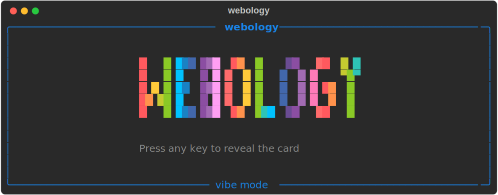

<h1 align="center">Welcome to webology 👋</h1>

<p align="center">
  
</p>

Inspired by [bnb/bitandbang](https://github.com/bnb/bitandbang)

### 🏠 [Homepage](https://github.com/jefftriplett/webology)

## :rocket: Usage

```shell
$ uvx webology
```

## 🤝 Contributing

Contributions, issues and feature requests are welcome!<br />Feel free to check [issues page](https://github.com/jefftriplett/webology/issues). 

<!-- [[[cog
import cog
import requests
response = requests.get("https://raw.githubusercontent.com/jefftriplett/actions/main/footer.txt")
response.raise_for_status()
print(response.text.strip())
]]] -->
## Author

👤 **Jeff Triplett**

* Website: https://jefftriplett.com
* Mastodon: [@webology](https://mastodon.social/@webology)
* Twitter: [@webology](https://twitter.com/webology)
* GitHub: [@jefftriplett](https://github.com/jefftriplett)

## Show your support

Give a ⭐️ if this project helped you!
<!-- [[[end]]] -->
